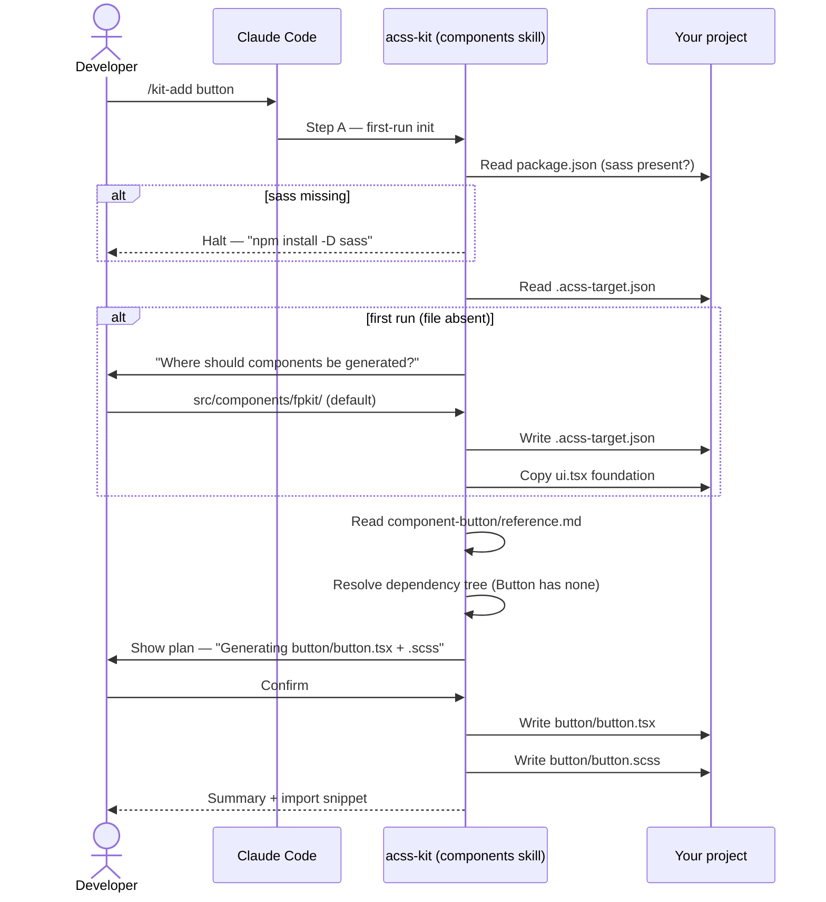
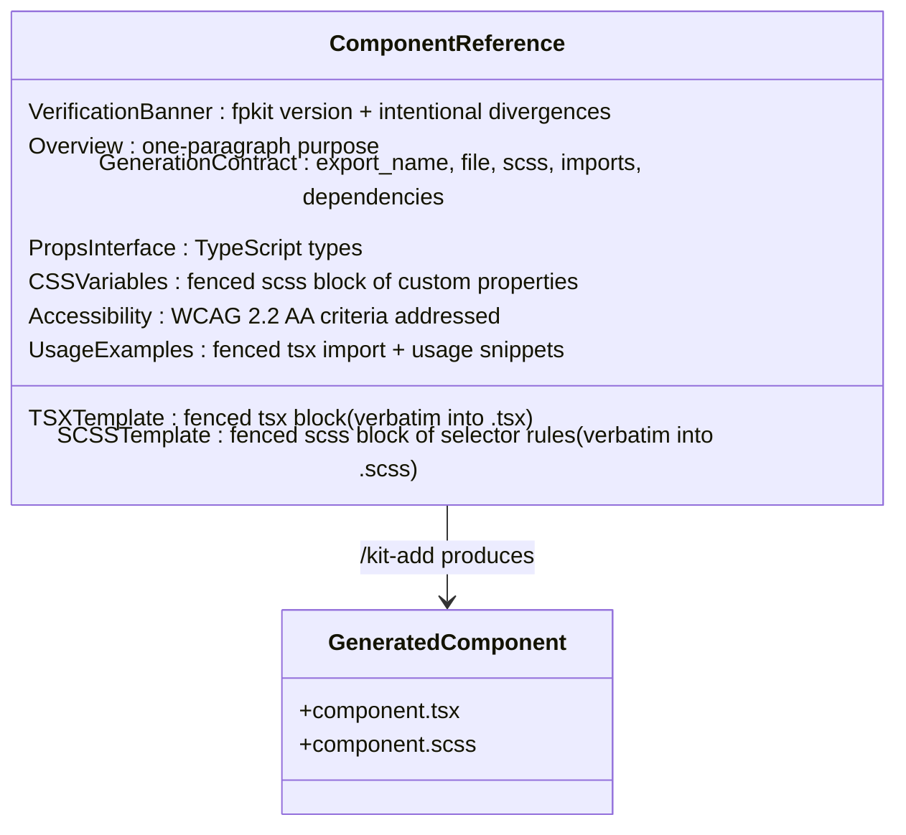
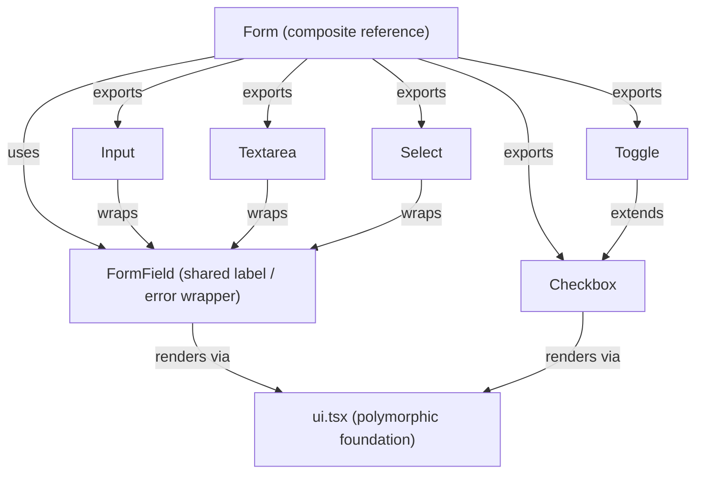
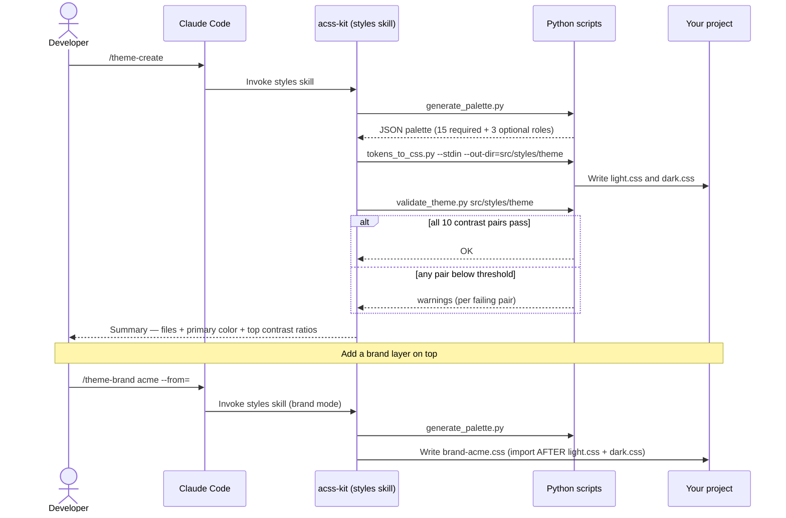
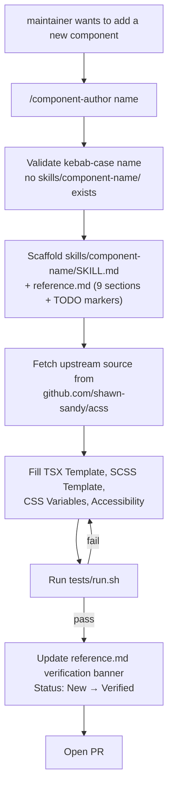

import { Aside } from "@astrojs/starlight/components";

Visual companion to the prose docs. Diagrams orient; the canonical docs go deep. For a step-by-step linear walkthrough, read the [Tutorial](/acss-plugins-docs/acss-kit/tutorial). For task-oriented snippets, read [Recipes](/acss-plugins-docs/acss-kit/recipes). For the mental model, read [Core Concepts](/acss-plugins-docs/acss-kit/concepts).

<Aside type="note">
  Diagrams below are written in [Mermaid](https://mermaid.js.org/) syntax. Paste
  any fenced `mermaid` block into the [Mermaid Live
  Editor](https://mermaid.live/) to render it interactively.
</Aside>

---

## How to read this guide

Every section pairs a diagram (or two) with a short caption and a link out to the canonical doc. Five visual formats appear below:

| Format                   | What it shows                                                            |
| ------------------------ | ------------------------------------------------------------------------ |
| Mermaid flowchart        | A command's lifecycle — boxes are steps, arrows are transitions          |
| Mermaid sequence diagram | An interaction over time — actors on top, time flowing down              |
| Mermaid class diagram    | The shape of a data structure — boxes are types, lines are relationships |
| ASCII tree               | A directory layout — usually before / after a command                    |

Audience labels:

- **USER** — for developers who installed `acss-kit` and want to add components to their own app.
- **MAINTAINER** — for contributors editing the plugin itself.

---

## What is acss-kit?

The plugin lives outside your project. When you run `/kit-add <component>`, Claude Code loads the matching reference doc from inside the plugin, copies the polymorphic `ui.tsx` foundation into your project on first run, and writes a self-contained `.tsx` + `.scss` pair that you own outright. There is no `@fpkit/acss` runtime dependency in your bundle — the generated code is yours to edit.

Read the prose: [Core Concepts](/acss-plugins-docs/acss-kit/concepts) for the full mental model and [Overview](/acss-plugins-docs/acss-kit/overview) for the index of every other doc.

---

## Your first component (USER — simple)

The simplest example. Button has no component dependencies — only the shared `ui.tsx` foundation gets pulled in — so a single command produces a working component.

### The lifecycle



### The file output

Before:

```text
src/components/
└── (empty)
```

After:

```text
project-root/
├── .acss-target.json           # records the chosen target dir — commit this
└── src/components/fpkit/
    ├── ui.tsx                  # polymorphic foundation (one per project)
    └── button/
        ├── button.tsx          # Button + inlined useDisabledState hook
        └── button.scss         # styles with hardcoded fallbacks for every CSS var
```

Read the prose: [Tutorial](/acss-plugins-docs/acss-kit/tutorial) — the same walkthrough with copy-paste-ready code at each step.

---

## The component anatomy

Every component the plugin can generate is described by a `reference.md` in its own `skills/component-<name>/` skill directory. They all share the same nine-section shape, which keeps `/kit-add` parsing predictable and gives both audiences a consistent map.



The **Generation Contract** is the only machine-readable section — `/kit-add` parses `export_name`, `file`, `scss`, `imports`, and `dependencies` to figure out which files to write and which dependencies to resolve. The other eight sections are read by Claude (and you) to make correct code-generation decisions.

Read the prose: [Kit-core skill](/acss-plugins-docs/acss-kit/skills/kit-core) for the component skill reference.

---

## Composing components (USER — advanced)

Most apps need more than a single Button. When you ask `/kit-add` for a component that has dependencies, the plugin walks the dependency tree and writes everything needed in one pass. Files that already exist are skipped, so your customizations survive re-runs.

The Form bundle is the most useful example. Requesting `/kit-add form` writes the full set of form controls plus the shared `FormField` wrapper.

### The dependency tree



`/kit-add` resolves bottom-up: `ui.tsx` first (if not already present), then `Field`, then each leaf control, then the composite `Form` itself.

### The file output

After `/kit-add form` (first run, no prior `/kit-add` in this project):

```text
src/components/fpkit/
├── ui.tsx
└── form/
    ├── form.tsx            # Input, Textarea, Select, Checkbox, Toggle, FormField (named exports)
    └── form.scss           # shared form / input / checkbox / toggle styles
```

Read the prose: [Recipes](/acss-plugins-docs/acss-kit/recipes) for first-run init, multi-component runs, and regeneration.

---

## Theming flow (USER — advanced)

Components ship with hardcoded CSS-variable fallbacks so they render the moment they land. Theming is purely additive: you generate a palette once and the components pick it up via `var(--color-primary, …)` references already in their SCSS.

### How a theme gets generated



Every theme file is just CSS custom properties — there is no JSON to maintain in your project. The schema is internal to the round-trip scripts; you author and edit `.css` directly.

Read the prose: [Styles skill](/acss-plugins-docs/acss-kit/skills/styles) for all four flows (`/theme-create`, `/theme-brand`, `/theme-update`, `/theme-extract`) and [Recipes](/acss-plugins-docs/acss-kit/recipes) for common theming tasks.

---

## Authoring a new component reference

<details>
<summary>For plugin maintainers — click to expand</summary>

Adding a new component to the plugin means writing a new reference doc that follows the canonical nine-section shape.



The validation gate (`tests/run.sh`) extracts the TSX and SCSS from the fenced code blocks and syntax-checks them, validates the SCSS contract (rem units, fallback-bearing `var()` calls, `[aria-disabled="true"]` selectors), runs WCAG contrast on the bundled themes, and replicates the manifest checks.

Read the prose: [Plugin Architecture](/acss-plugins-docs/contributing/architecture) for the contributor guide.

</details>

---

## Where to go next

| You want to…                                                               | Read                                                                |
| -------------------------------------------------------------------------- | ------------------------------------------------------------------- |
| Generate your first component end-to-end                                   | [Tutorial](/acss-plugins-docs/acss-kit/tutorial)                    |
| Solve a specific task (regenerate, change target dir, multiple components) | [Recipes](/acss-plugins-docs/acss-kit/recipes)                      |
| Understand the polymorphic UI base, data-\* variants, CSS-var fallbacks    | [Core Concepts](/acss-plugins-docs/acss-kit/concepts)               |
| Look up a slash command flag                                               | [Prompt Book](/acss-plugins-docs/acss-kit/commands/prompt-book)     |
| Diagnose a failure                                                         | [Troubleshooting](/acss-plugins-docs/reference/troubleshooting)     |
| Author a new component or theme inside the plugin                          | [Plugin Architecture](/acss-plugins-docs/contributing/architecture) |
